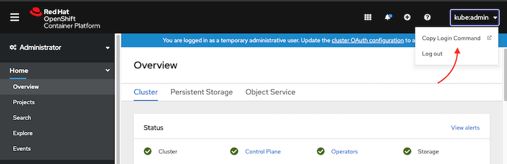

# Installing ACE to MQ TLS MA Demon on OpenShift


_**Warning:** WORK IN PROGRESS!!! NOT YET READY_


## Pre-requisite

1. Install Docker/Podman in your installation machine.

1. Install OpenShift 4.6 Cluster

1. Install storage classes for that supports ReadWriteOnce(RWO) and ReadWriteMany(RWX)

2. Add IBM catalog sources to your OpenShift cluster

    See [Adding catalog sources to your OpenShift cluster (online installation)](https://www.ibm.com/docs/en/cloud-paks/cp-integration/2021.4?topic=installing-adding-catalog-sources-your-openshift-cluster-online-installation) for details.

3. Install Platform Navigator operator cluster-wide

    The operator can be found in the OpenShift Operator Hub, once IBM Operator Catalog and the IBM Common Services Catalog are installed.

    See [Installing the operators using the CLI](https://www.ibm.com/docs/en/cloud-paks/cp-integration/2021.4?topic=installing-operators-using-cli) for details.

4. Access the IBM Entitled Registry entitlement key

    See [IBM Entitled Registry entitlement keys](https://www.ibm.com/docs/en/cloud-paks/cp-integration/2021.4?topic=installing-applying-your-entitlement-key-online-installation)

    We would need the key to be installed as a secret in every namespaces where we install a CP4I capability.

1. Install the Platform navigator on a namespace.

    We recommend using `cp4i` namespace for this. Install the IBM Entitled Registry entitlement key on this chosen namespace.

    See [Deploying IBM Cloud Pak for Integration using the CLI](https://www.ibm.com/docs/en/cloud-paks/cp-integration/2021.4?topic=installing-deploying-cloud-pak-integration-using-openshift-console) 


1. Update `env.sh` file as necessary to fit your deployment

    `PREFIX` is used in naming the certficates, keys and some objects within the capabilities. Usually it is the name of the company, in lower case. For exmaple, `ibm`.

    `FILE_STORAGE_CLASS` and `BLOCK_STORAGE_CLASS` are the storage classes installed on OCP for file and block storages.

    `TRACING_NAMESPACE`,  `MQ_NAMESPACE`, `DATAPOWER_NAMESPACE`, `MONGO_NAMESPACE`, `ACE_NAMESPACE` are the namespaces where the corresponding capabilites are to be installed.

    `TRACING_VERSION`, `MQ_VERSION`, `DATAPOWER_VERSION` and `ACE_VERSION` are the versions of the corresponding capabilites are to be installed.

    `MONGO_INSTANCE` is the name of the mongo instance to be installed.

    `ACE_LICENSE` and `ACE_USE` are licensing fields to be used when installing ACE capababilities.

    `COMMON_NAME`, `ORGANISATION`, `COUNTRY`, `LOCALITY`, `STATE` sets the fields in Distinguished Name in the certificate. Note that organisation unit is automatically set. Also note that `COMMON_NAME` should not be more that 64 characters long. For longer common names, make use of `SAN_DNS` field.

    `SAN_DNS` is the subject alternative name. In this exercise, it is used for specifying longer hostnames (longer than 64 characters). If host name is not longer than 64 characters, it should be the same as the `COMMON_NAME`.

1. Install `oc` and `kubectl` command line tool.

    You can download them from here:

    [https://mirror.openshift.com/pub/openshift-v4/x86_64/clients/oc/4.6/](https://mirror.openshift.com/pub/openshift-v4/x86_64/clients/oc/4.6/)

1.  Login to OCP via the `oc` command

    This can be done via the access token:

    

1.  Expose OpenShift internal registry.

    This can done via

    ```bash
    oc patch configs.imageregistry.operator.openshift.io/cluster --patch '{"spec":{"defaultRoute":true}} ' --type=merge
    ```

    See [Exposing the registry](https://docs.openshift.com/container-platform/4.6/registry/securing-exposing-registry.html) for more details.


## Install CP4I Capabilities

This installation instruction comes with a set of scripts, organised in different folders. The root of this folder is `client-deployment`:

```
client-deployment
├── README.md <------- this file
├── ace <------------- includes scripts to install Integration Servers
├── cert-generation <- includes scripts to create certificates/keys
├── common <---------- includes common helper scripts for this installation
├── entitlement-key <- includes script to copy IBM entitlement key from `cp4i` to a given namesapce
├── env.sh <---------- includes common env variables used by the scripts
├── installer <------- includes Dockerfile to create a installer shell
├── ldap <------------ includes scripts to install OpenLDAP
├── mq <-------------- includes scripts to install MQ cluster
├── paths.sh <-------- includes common env variables (paths to key/certs) used by the scripts
└── readme_images <--- includes images used by this README.md
```

We will install the components in the following order:

1. Cert Generation
1. LDAP
1. MQ
1. ACE Integration Servers

Start by installing an LDAP instance, [ldap/README.md](tracing/README.md).
